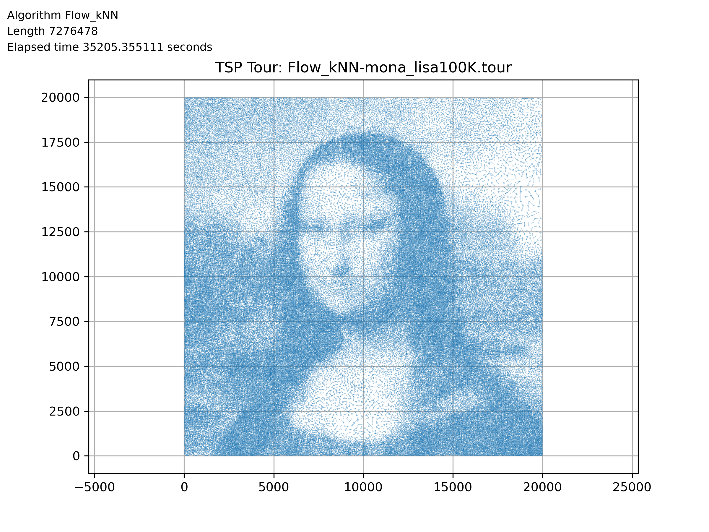
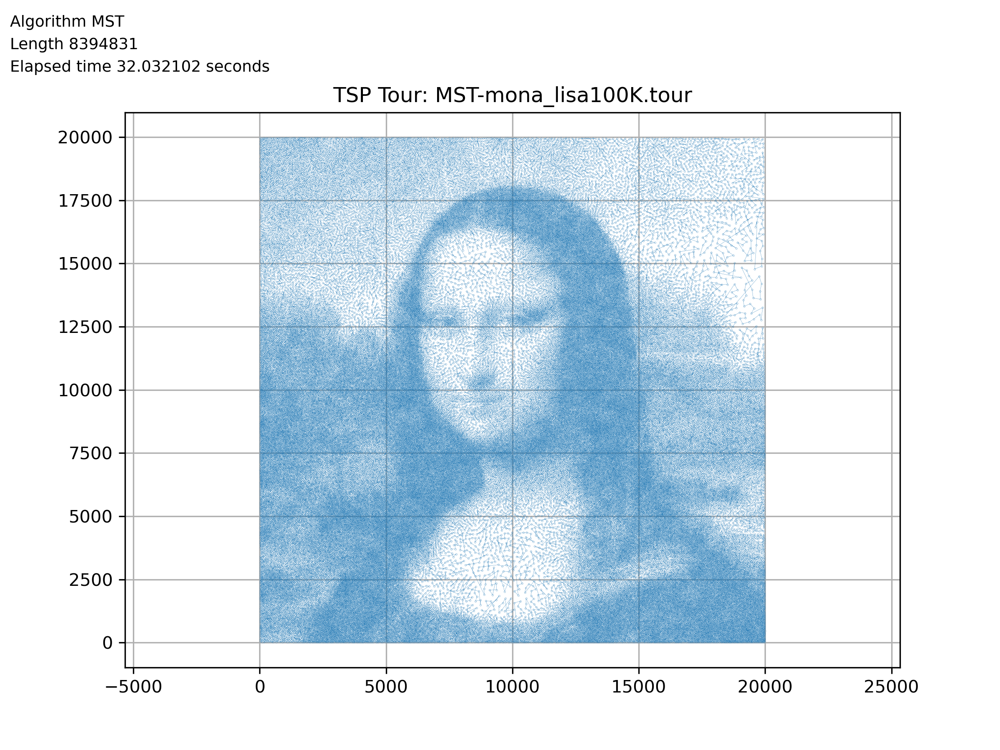

# 🗺️ Traveling Salesman Problem (TSP) Solver

<a href="https://github.com/hoonably/traveling-salesman"></a> <a href="./Solving_the_Traveling_Salesman_Problem.pdf"></a>

---

## 🧠 Highlights
<p float="left">   </p>

<p float="left">   </p>

- 🧭 Exact Method: Held-Karp for small instances (n ≤ 20)
- ⚡ Fastest Practical: Greedy + 2-opt (fast + high-quality)
- 🔁 New Hybrid Algorithm: Flow-based initialization + 2-opt refinement
- 📈 Notable Outlier: MST shows poor scaling on mona_lisa100K due to rigid traversal and long edges
- 🧪 Evaluation: runtime, quality, scalability on 5 datasets


---

## 📘 Project Overview

This project was conducted for **CSE331: Algorithm** at **UNIST**.
We implemented and evaluated the following algorithms:

| Category     | Algorithms                                                    |
| ------------ | ------------------------------------------------------------- |
| Exact        | Held-Karp (Dynamic Programming)                               |
| Approximate  | MST-based 2-Approx, Greedy Nearest-Neighbor                   |
| Local Search | 2-Opt Optimization                                            |
| Heuristic    | Flow-based Cycle Cover (MCMF), Flow + 2opt, Flow_kNN (+2opt) |

---

## 📁 Directory Structure

```bash
.
├── dataset/             # Input TSP files (TSPLIB format)
├── tour_paths/          # Output .tour files for each algorithm and dataset
├── tour_image/          # Visualized paths (PNG)
├── summary/             # Summary tables (.csv, .md)
├── *.cpp                # Algorithm implementations
├── *.h                  # Shared utilities (util.h, util2.h)
├── _make_summary.py     # CSV/MD aggregator
├── _visualize_tsp_paths.py  # Tour plotter
└── pdf/                 # Project manual and references
```

---

## ⚙️ How to Run

Each algorithm is defined in a standalone `.cpp` file and contains a hardcoded main loop.

### 🔧 Example: Run Greedy + 2opt

```bash
g++ -std=c++17 -O2 Greedy.cpp -o greedy
./greedy
```

### 🛠 Internal Configuration

Inside each file, you’ll find:

```cpp
#include "util.h"
// #include "util2.h"  // ← use this for 100K-city dataset

vector<string> files = {
    "weird20.tsp", "a280.tsp", "xql662.tsp", "kz9976.tsp",
    // "mona_lisa100K.tsp"
};

bool use_2opt = true;  // enable local optimization
```

> 💡 To test large-scale instances (`mona_lisa100K.tsp`), switch to `util2.h` and disable 2-opt (`use_2opt = false`) for memory efficiency.

---

## 📊 Summary of Results

| Dataset (Opt)        | Algorithm | Base Len    | Time (s)  | +2opt Algorithm   | +2opt Len   | Time (s)   | 2opt Iters |
| -------------------- | --------- | ----------- | --------- | ----------------- | ----------- | ---------- | ---------- |
| **a280 (2579)**      | Random    | 33736       | –         | Random (+2opt)    | 2774        | 0.0229     | 1368       |
|                      | Greedy    | **3157**    | 0.0001    | Greedy (+2opt)    | 2767        | 0.0030     | 57         |
|                      | MST       | 3492        | 0.0003    | MST (+2opt)       | 2908        | 0.0045     | 80         |
|                      | Flow      | 3417        | 0.0162    | Flow (+2opt)      | 2705        | 0.0190     | 66         |
|                      | Flow_kNN | 3348        | 0.0067    | Flow_kNN (+2opt) | **2696**    | 0.0118     | 82         |
| **xql662 (2513)**    | Random    | 53168       | –         | Random (+2opt)    | 2762        | 0.2770     | 3945       |
|                      | Greedy    | **3124**    | 0.0008    | Greedy (+2opt)    | **2693**    | 0.0320     | 116        |
|                      | MST       | 3593        | 0.0012    | MST (+2opt)       | 2763        | 0.0393     | 237        |
|                      | Flow      | 3862        | 0.0641    | Flow (+2opt)      | 2719        | 0.0931     | 267        |
|                      | Flow_kNN | 3931        | 0.0341    | Flow_kNN (+2opt) | 2737        | 0.0700     | 301        |
| **kz9976 (1061882)** | Random    | 133724845   | –         | Random (+2opt)    | 1154441     | 3582.80    | 119612     |
|                      | Greedy    | **1358249** | 0.0616    | Greedy (+2opt)    | 1141502     | 146.80     | 3340       |
|                      | MST       | 1456572     | 0.1276    | MST (+2opt)       | 1162397     | 171.80     | 4638       |
|                      | Flow      | 1707487     | 210.41    | Flow (+2opt)      | **1138579** | 537.88     | 5619       |
|                      | Flow_kNN | 1719092     | 21.79     | Flow_kNN (+2opt) | 1146693     | 318.39     | 6231       |


More results: [`summary/summary_table.csv`](summary/summary_table.csv)

---

## 🖼 Tour Visualizations

All solution tours are saved as `.png` in `tour_image/`.

```bash
tour_image/a280/Greedy(+2opt)-a280.png
tour_image/kz9976/Flow_kNN(+2opt)-kz9976.png
```

Use `_visualize_tsp_paths.py` to batch regenerate or customize.

---

## 🧪 Experimental Setup

* 💻 **Device**: MacMini (Apple M4, 16GB RAM)
* ⚙️ **Compiler**: `clang++ -std=c++17 -O2`
* 📊 **Datasets**:

  * weird20 (20 cities)
  * a280 (280 cities)
  * xql662 (662 cities)
  * kz9976 (9976 cities)
  * mona\_lisa100K (100,000 cities)

---

## 📎 Reference

📄 [Solving the Traveling Salesman Problem (Project Report)](./Solving_the_Traveling_Salesman_Problem.pdf)